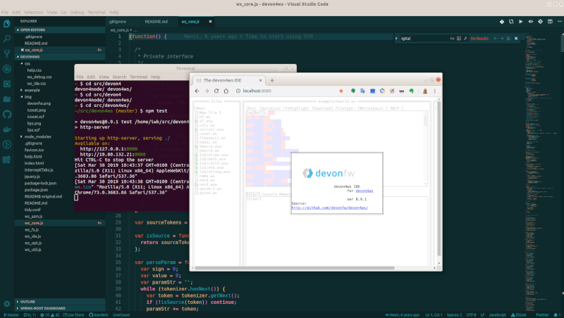

# devon4ws - a programming language and online IDE for devonfw

We're proud to announce devon4ws, a programming language and online IDE for devonfw.

[devon4ws is Capgemini's own Enterprise ready, web scale, programming language, compiler, virtual machine and online IDE](https://github.com/devonfw/devon4ws/).

Why yet another language and IDE? Because most major Digital giants have launched their own languages and tool-chain:

* Oracle has Java
* Google has Go
* Apple has Swift and Objective C
* Microsoft created a whole set of languages, like C#, F#, Visual Basic etc.
* Facebook strongly supports OCaml and EcmaScript 2015+ (through Babel)
* AT&T is still a major supporter of C++

etc etc

So Capgemini, as one of the world's premier Consulting, Technology, Digital Transformation Services companies could not stay behind. So we have adopted a strong Industry Standard language and incorporated it in devonfw, the Open Source Standard Development Platform for Capgemini Europe and India. 

## to get started

In a console execute

`git clone https://github.com/devonfw/devon4ws/`

go to the devon4ws directory and execute

`npm install`

to install the dependencies and then start the online IDE with

`npm test`

[Open a browser and navigate to http://localhost:8080](http://localhost:8080) to access the online IDE.

## devon4ws features

* virtual machine,
* run-time optimizer,
* On-the-fly compilation,
* Local storage (browser) for programs (programs are never sent to the server),
* Assembly virtual machine and compiler ,
* Disassebler,
* Debugging source and assembly programs,
* syntax highlighting,
* Example programs (including a Brainf*** [interpreter](https://github.com/vii5ard/brainfuck-whitespace)).
* Assembly macros,
* Assembly libraries:
  - lib/alias.ws - Aliases for compatibility with other assemby implementations.
  - lib/math.ws - Math functions (e.g. sqrt) .
  - lib/rot13.ws - rot13.
  - lib/std.ws - Includes all the libraries.
  - lib/string.ws - Some useful string functions.

see readme-original.md for original work, copyright and attributions.